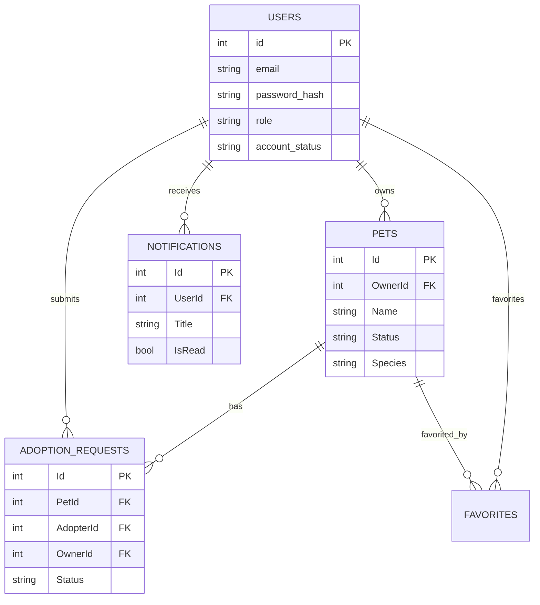

# PetAdopt Backend Technical Documentation

This document provides a comprehensive technical overview of the PetAdopt backend system, a .NET 10.0 (or .NET 8.0) Web API designed for pet adoption management.

---

## 📌 1. APIs Documentation

### Authentication Controller (`api/auth`)
| Method | Endpoint | Purpose | Auth |
| :--- | :--- | :--- | :--- |
| POST | `/register` | Register a new Adopter | Public |
| POST | `/register/shelter` | Register a new Sanctuary/Shelter | Public |
| POST | `/login` | Authenticate user and return JWT + Refresh Token | Public |
| POST | `/refresh` | Refresh an expired access token | Public |
| POST | `/logout` | Invalidate a refresh token | [Authorize] |
| GET | `/me` | Get current user's profile | [Authorize] |

### Pets Controller (`api/pets`)
| Method | Endpoint | Purpose | Auth |
| :--- | :--- | :--- | :--- |
| GET | `/` | Get all approved pets (supports filters: species, breed, location, age) | Public |
| GET | `/{id}` | Get specific pet details by ID | Public |

### Shelter Pets Controller (`api/shelter/pets`)
| Method | Endpoint | Purpose | Auth |
| :--- | :--- | :--- | :--- |
| GET | `/` | List all pets owned by the current shelter | [Shelter] |
| POST | `/` | Create a new pet listing (Status: PendingReview) | [Shelter] |
| PUT | `/{id}` | Update an existing pet listing | [Shelter] |
| DELETE | `/{id}` | Remove a pet listing | [Shelter] |

### Adoption Requests Controller (`api/adoption-requests`)
| Method | Endpoint | Purpose | Auth |
| :--- | :--- | :--- | :--- |
| POST | `/` | Submit an adoption request for a pet | [Adopter] |
| GET | `/` | List all adoption requests submitted by current user | [Adopter] |

### Admin Users Controller (`api/admin/users`)
| Method | Endpoint | Purpose | Auth |
| :--- | :--- | :--- | :--- |
| GET | `/` | Get all pending shelter accounts | [Admin] |
| GET | `/status/{status}` | Filter users by status (Pending, Approved, Rejected, Suspended) | [Admin] |
| PATCH | `/{id}/approve` | Approve a shelter account | [Admin] |
| PATCH | `/{id}/reject` | Reject a shelter account | [Admin] |
| PATCH | `/{id}/suspend` | Suspend a user account | [Admin] |

### Admin Pets Controller (`api/admin/pets`)
| Method | Endpoint | Purpose | Auth |
| :--- | :--- | :--- | :--- |
| GET | `/` | Get all pets pending review | [Admin] |
| PATCH | `/{id}/approve` | Approve a pet listing for public view | [Admin] |
| PATCH | `/{id}/reject` | Reject a pet listing | [Admin] |

---

## 📂 2. Project Structure Explanation

The project follows a standard N-Layered Architecture:

### Folders & Responsibilities
- **`Controllers/`**: Entry points for HTTP requests. They handle request routing, basic validation, and return HTTP responses.
- **`Services/`**: Contains business logic. 
    - `AuthService.cs`: Manages registration, password hashing (BCrypt), JWT generation, and refresh token logic.
    - `NotificationService.cs`: Handles real-time notification delivery via SignalR and DB persistence.
    - `EncryptionService.cs`: Utility for data security.
- **`Models/`**: 
    - **Entities**: Database models representing tables (e.g., `User.cs`, `Pet.cs`, `AdoptionRequest.cs`).
    - **DTOs**: Data Transfer Objects for request/response bodies (e.g., `RegisterDto.cs`, `AuthResponseDto.cs`).
    - **Enums**: Application constants like `Role` and `PetStatus`.
- **`Data/`**: 
    - `AppDbContext.cs`: Entity Framework Core context, defining table mappings and relationships.
    - `DatabaseSeeder.cs`: Seeds initial Admin and test data into the database.
- **`Hubs/`**: 
    - `NotificationHub.cs`: SignalR hub for real-time websocket communication.
- **`Middleware/`**: Handled via `Program.cs` (JWT Auth, CORS, Exception Handling).

### Layer Interaction
1. **Client** sends an HTTP request.
2. **Middleware** (CORS, Authentication) validates the request.
3. **Controller** receives the request, extracts data, and calls the appropriate **Service** or **DbContext**.
4. **DbContext** interacts with the **MySQL Database** via EF Core.
5. **SignalR Hubs** may be triggered by services to notify the client in real-time.

---

## 🗄️ 3. Database Schema (ERD Description)

### Tables & Columns

#### **Users**
- `id` (INT, PK, Identity)
- `first_name`, `last_name`, `email` (Unique), `password_hash`
- `role` (Enum: Adopter, Shelter, Admin)
- `account_status` (Enum: Pending, Approved, Rejected, Suspended)
- `city`, `country`, `phone_number`
- `created_at`, `updated_at`

#### **Pets**
- `Id` (INT, PK, Identity)
- `Name`, `Description`, `Breed`, `Location`, `ImageUrls` (CSV string)
- `Age` (INT), `AgeUnit` (Enum: Months, Years)
- `Species` (Enum: Dog, Cat, Other), `Gender` (Enum)
- `Status` (Enum: PendingReview, Approved, Adopted, Rejected)
- `OwnerId` (INT, FK -> Users.id)
- `CreatedAt`

#### **AdoptionRequests**
- `Id` (INT, PK, Identity)
- `PetId` (INT, FK -> Pets.Id)
- `AdopterId` (INT, FK -> Users.id)
- `OwnerId` (INT, FK -> Users.id)
- `Message`, `WhyThisPet`
- `Status` (Enum: Pending, Accepted, Rejected)
- `RequestedAt`

#### **Notifications**
- `Id` (INT, PK, Identity)
- `UserId` (INT, FK -> Users.id)
- `Title`, `Message`, `Type` (Success, Warning, Error, Info)
- `TargetId`, `TargetType` (Pet, User, AdoptionRequest)
- `IsRead` (Boolean)
- `CreatedAt`

### Relationships
- **User -> Pets**: One-to-Many (One Shelter/User can own multiple pets).
- **Pet -> AdoptionRequests**: One-to-Many (One pet can have multiple requests).
- **User -> AdoptionRequests**: One-to-Many (One Adopter can submit many requests).
- **Pet -> Favorites**: Many-to-Many (via junction table).

### ERD Representation

---

## 🏗️ 4. System Architecture Overview

### End-to-End Request Flow
1. **Frontend (React)**: User clicks "Adopt Pet". Frontend sends `POST /api/adoption-requests` with a JWT in the `Authorization` header.
2. **Authentication Middleware**: Backend checks JWT signature and expiry. If valid, populates `User.Identity`.
3. **AdoptionRequestsController**: `SubmitAdoptionRequest` is called.
    - It verifies the Pet exists and is available.
    - It saves the request to the database.
    - It calls `NotificationService`.
4. **NotificationService**:
    - Saves a `Notification` record in the DB for the Shelter.
    - Triggers `NotificationHub` to send a SignalR message to the Shelter's specific client connection.
5. **Response**: Controller returns `200 OK` with the request object to the frontend.

### Authentication & Authorization
- **JWT**: Stateless authentication using a Secret Key defined in `appsettings.json`.
- **Roles**: Role-based access control (RBAC) using `[Authorize(Roles = "Admin")]` etc.
- **Refresh Tokens**: Stored in DB to allow users to stay logged in securely without long-lived access tokens.

### External Integrations
- **SignalR**: Used for real-time UI updates (e.g., a "New Request" toast appears instantly for the shelter).
- **EF Core (MySql)**: ORM for database abstraction.
- **BCrypt.Net**: Secure password hashing for user credentials.
