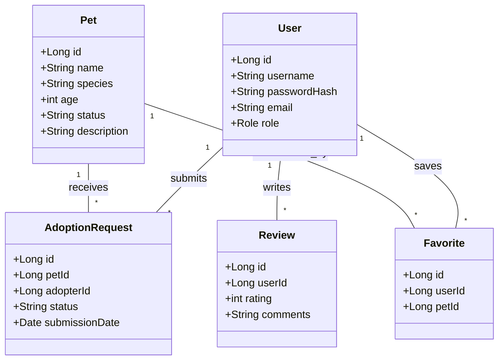
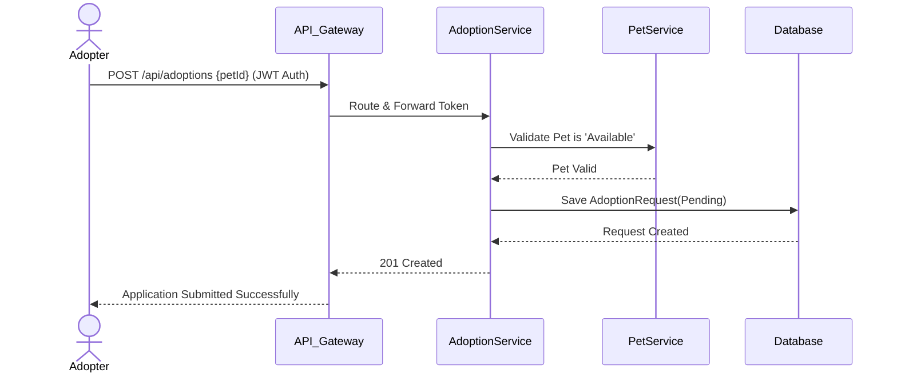
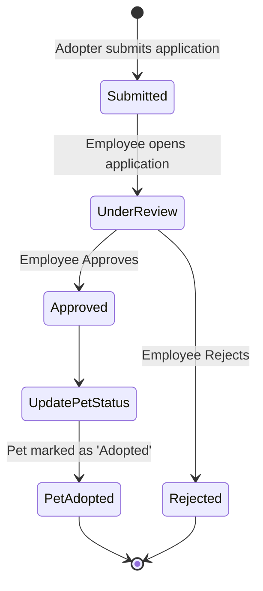

# Software Requirements Specification (SRS) & System Design
## Project: PetAdopt Platform

### 1. Introduction
The PetAdopt platform is a comprehensive, microservices-based web application designed to bridge the gap between animal shelters and prospective pet adopters. The primary goal of the system is to digitize and streamline the pet adoption process. This document outlines the functional and non-functional requirements, system architecture, and development plan to transition the platform into a highly scalable, robust ecosystem suitable for modern deployment standards.

### 2. System Overview
The system is architected as a set of distributed microservices built with Java Spring Boot. These services operate independently but communicate cohesively to provide a unified experience. The backend relies on Spring Cloud for infrastructure components like API Gateway and Service Discovery (Eureka). The frontend is a separate React application that interfaces solely with the API Gateway, ensuring decoupling of user interface concerns from backend logic. The entire application suite is containerized using Docker and orchestrated locally via Docker Compose.

### 3. Functional Requirements
The system is composed of four primary functional modules:

**3.1 User Identity & Access Management**
* **FR1.1:** The system shall allow users to register an account and authenticate using JWT (JSON Web Tokens).
* **FR1.2:** The system shall enforce Role-Based Access Control (RBAC) with three distinct roles: `Admin`, `Employee` (Shelter Worker), and `Adopter`.
* **FR1.3:** The system shall restrict access to administrative endpoints to `Admin` users only.

**3.2 Pet Catalog & Management**
* **FR2.1:** `Employee` and `Admin` users shall be able to add, update, and remove pet profiles (including species, breed, age, and images).
* **FR2.2:** `Adopter` users shall be able to view and search for available pets based on various filters.
* **FR2.3:** The system shall maintain the current adoption status of every pet (e.g., Available, Pending, Adopted).

**3.3 Adoption Workflow**
* **FR3.1:** `Adopter` users shall be able to submit adoption applications for pets marked as 'Available'.
* **FR3.2:** `Employee` users shall be able to view submitted applications and transition their status (e.g., Pending -> Approved or Rejected).
* **FR3.3:** The system shall automatically update a pet's status to 'Adopted' upon final application approval.

**3.4 Interaction & Engagement**
* **FR4.1:** `Adopter` users shall be able to add pets to a personal "Favorites" list.
* **FR4.2:** Users shall be able to leave reviews or feedback.
* **FR4.3:** The system shall trigger and record notifications when an adoption application status changes.

---

### 4. Non-Functional Requirements
* **NFR1 (Framework & Language):** All backend services must be written in Java using the Spring Boot framework.
* **NFR2 (Architecture):** The system must utilize a Microservices architecture.
* **NFR3 (Security):** All API communication must be secured via HTTPS, and endpoints must be protected using JWT authentication.
* **NFR4 (AOP Implementation):** Aspect-Oriented Programming (AOP) must be utilized globally across microservices to handle cross-cutting concerns, specifically for automated logging of request/response payloads and method execution performance monitoring.
* **NFR5 (Data Persistence):** A relational database (MySQL or PostgreSQL) must be used. Each microservice should logically (or physically) manage its own schema.
* **NFR6 (Containerization):** The entire system, including databases, service discovery, and API gateway, must be fully containerized using Docker and deployable via a single `docker-compose.yml` file.

---

### 5. System Architecture (Microservices)
The backend infrastructure is decoupled into the following structural components:

* **Frontend (React Module):** Serves as the UI. It does not communicate with backend services directly; all HTTP requests are sent to the API Gateway.
* **Spring Cloud Eureka Server (Service Discovery):** Acts as the registry where all microservices announce their presence, allowing services to find each other dynamically without hardcoded IPs.
* **Spring Cloud API Gateway:** The single entry point for the React frontend. It handles routing requests to the appropriate microservice, CORS configuration, and initial token validation.
* **Auth Service:** Issues JWTs and manages user credentials.
* **Pet Service:** Manages pet data.
* **Adoption Service:** Manages adoption applications.
* **Interaction Service:** Manages favorites, reviews, and notifications.

---

### 6. UML Diagrams

#### 6.1 Use Case Diagram
```mermaid
usecaseDiagram
    actor Adopter
    actor Employee
    actor Admin

    package "PetAdopt System" {
        usecase "Register & Login (JWT)" as UC1
        usecase "Browse & Filter Pets" as UC2
        usecase "Manage Pets (CRUD)" as UC3
        usecase "Submit Adoption App" as UC4
        usecase "Review Applications" as UC5
        usecase "Manage Favorites" as UC6
        usecase "Manage Users" as UC7
    }

    Adopter --> UC1
    Adopter --> UC2
    Adopter --> UC4
    Adopter --> UC6

    Employee --> UC1
    Employee --> UC3
    Employee --> UC5

    Admin --> UC1
    Admin --> UC7
    Admin --> UC3
```

#### 6.2 Class Diagram (Domain Model)


#### 6.3 Sequence Diagram (Adoption Process)


#### 6.4 Activity Diagram (Adoption Review Workflow)


---

### 7. Project Division (6 Developers)

To ensure a balanced workload and efficient parallel development, the project is divided into six highly specialized roles.

#### **Developer 1: Infrastructure & DevOps (Lead)**
* **Responsibility:** Set up the foundational Spring Cloud architecture and Docker orchestration.
* **Step-by-Step Implementation:**
  1. Initialize the **Eureka Service Discovery** server project.
  2. Initialize the **Spring Cloud API Gateway** and configure routing rules.
  3. Create standard `Dockerfile` templates for the Spring Boot microservices.
  4. Build the master `docker-compose.yml` to orchestrate the Relational Database, Eureka, API Gateway, and all backend microservices.
  5. Ensure network communication between containers is functional.

#### **Developer 2: Security & Identity Management**
* **Responsibility:** Implement the User Identity & Access Management Module.
* **Step-by-Step Implementation:**
  1. Initialize the **Auth Service** Spring Boot application.
  2. Configure Spring Security and write the JWT generation/validation utility classes.
  3. Implement User Registration and Login REST endpoints.
  4. Implement Role-Based Access Control logic.
  5. Coordinate with Dev 1 to ensure the API Gateway can properly forward Authorization headers to other services.

#### **Developer 3: Pet Catalog & AOP Specialist**
* **Responsibility:** Implement the Pet Management Module and enforce AOP across the project.
* **Step-by-Step Implementation:**
  1. Initialize the **Pet Service** and connect it to its database schema.
  2. Create full CRUD REST endpoints for pet profiles (Add, Update, Delete, List, Filter).
  3. Implement **Spring AOP**. Create Aspect classes (`@Aspect`) with `@Before` and `@AfterReturning` advice to log all API requests, responses, and execution times globally.
  4. Refine the AOP configuration module and share it with the rest of the team for inclusion in their respective services.

#### **Developer 4: Adoption Workflow Engine**
* **Responsibility:** Implement the core business logic for pet adoptions.
* **Step-by-Step Implementation:**
  1. Initialize the **Adoption Service**.
  2. Use Spring Cloud OpenFeign to establish synchronous communication with the Pet Service (to check if a pet is available before creating an application).
  3. Create endpoints for users to submit applications.
  4. Create endpoints for employees to update application statuses.
  5. Handle the transactional logic to ensure when an adoption is finalized, the Pet's status is officially changed to 'Adopted'.

#### **Developer 5: Interaction & Engagement Service**
* **Responsibility:** Build user-focused engagement features.
* **Step-by-Step Implementation:**
  1. Initialize the **Interaction Service**.
  2. Implement the "Favorites" logic, allowing users to save and retrieve their favorite pets.
  3. Implement the Review system (CRUD for user reviews).
  4. Develop a Notification trigger system (e.g., creating a notification record when an application is approved).

#### **Developer 6: Frontend Integration (React Dedicated)**
* **Responsibility:** Connect the existing React application to the new Microservices architecture.
* **Step-by-Step Implementation:**
  1. Audit the existing React `frontend/` source code to map out all necessary API endpoints.
  2. Refactor Axios/Fetch calls to point entirely to the new API Gateway URL (e.g., `http://localhost:8080/api/...`).
  3. Update the frontend authentication state management to handle JWTs securely (e.g., storing in HTTP-only cookies or memory, handling token expiration).
  4. Adjust the UI state to handle new structured error responses from the Spring Boot backend.
  5. Test end-to-end flows using the Docker Compose environment provided by Dev 1.
