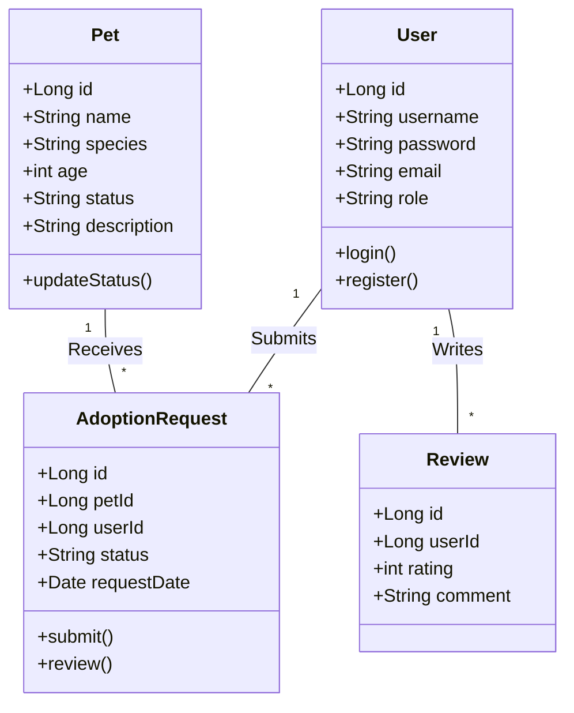
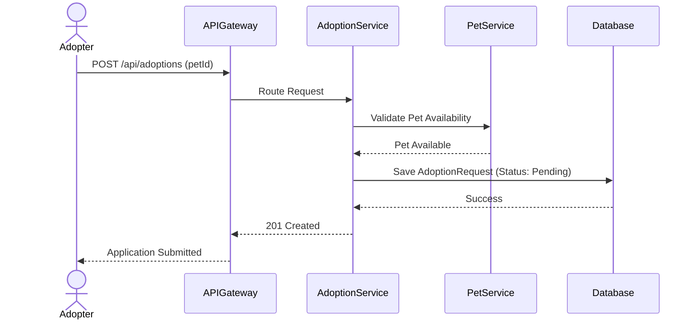
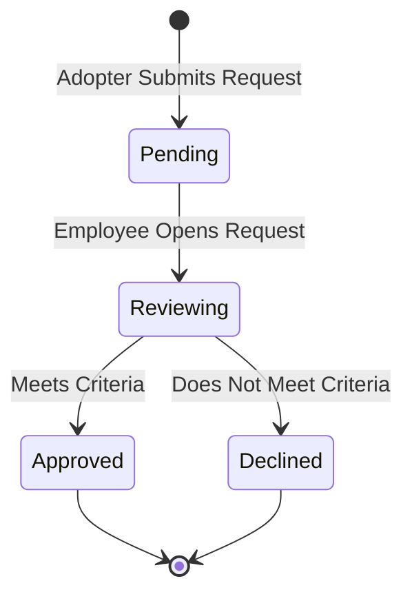

# PetAdopt: Software Engineering-2 Project Plan

## 1. Project Overview & Architectural Shift
Currently, the PetAdopt backend is built as a monolithic ASP.NET Core application. To fulfill the requirements of the Software Engineering-2 project, the backend will be completely rewritten into a **Java Spring Boot Microservices Architecture** using **Spring Cloud**. The React frontend will be retained but updated to communicate with the new API Gateway.

### Core Technologies
*   **Backend**: Java, Spring Boot, Spring Data JPA
*   **Microservices Infrastructure**: Spring Cloud (API Gateway, Netflix Eureka for Service Discovery)
*   **Security**: Spring Security, JWT (JSON Web Tokens)
*   **AOP**: Spring AOP (Aspect-Oriented Programming) for cross-cutting concerns like logging and performance monitoring
*   **Database**: MySQL or PostgreSQL
*   **Containerization**: Docker & Docker Compose
*   **Frontend**: React.js (existing)

---

## 2. Four Functional Modules
The application is divided into four primary functional modules to satisfy the project requirements:

1.  **User Identity & Access Management Module**
    *   Registration, Authentication (Login), and Profile Management.
    *   Role-Based Access Control (Roles: `ROLE_ADMIN`, `ROLE_EMPLOYEE` (Shelter), `ROLE_ADOPTER`).
2.  **Pet Catalog & Management Module**
    *   Shelter Employees and Admins can add, update, and remove pets.
    *   Adopters can browse, filter, and view pet details.
3.  **Adoption Workflow Module**
    *   Adopters submit adoption applications.
    *   Shelter Employees review, approve, or reject applications.
4.  **Engagement & Notification Module**
    *   Adopters can add pets to favorites and leave reviews.
    *   Real-time or polled notifications for adoption status updates.

---

## 3. Aspect-Oriented Programming (AOP) Implementation
AOP will be utilized to cleanly separate cross-cutting concerns from business logic:
*   **Logging Aspect**: Intercepts all REST API calls across microservices to log request/response details, execution time, and errors without cluttering controllers.
*   **Authorization Aspect (Optional)**: Custom annotations to enforce role-based access before a method executes.

---

## 4. Software Requirements Specification (SRS)

### 4.1. Purpose
The PetAdopt system provides a centralized platform for animal shelters to list pets and for potential adopters to browse, apply, and adopt pets seamlessly.

### 4.2. Functional Requirements
*   **FR1**: The system must allow users to register and authenticate using JWT.
*   **FR2**: The system must enforce authorization based on user roles (`Admin`, `Employee`, `Adopter`).
*   **FR3**: Employees must be able to perform CRUD operations on pet listings.
*   **FR4**: Adopters must be able to view pets, filter them by attributes (species, age), and mark them as favorites.
*   **FR5**: Adopters must be able to submit adoption requests for available pets.
*   **FR6**: Employees must be able to review and update the status of adoption requests (Pending -> Approved/Declined).

### 4.3. Non-Functional Requirements
*   **NFR1 (Architecture)**: The system must be built using a Microservices architecture.
*   **NFR2 (Containerization)**: All services and databases must be deployable via Docker containers.
*   **NFR3 (Maintainability)**: AOP must be used for system-wide logging.
*   **NFR4 (Performance)**: The API Gateway must efficiently route traffic to appropriate underlying services.

---

## 5. System Diagrams

### 5.1. Use Case Diagram
```mermaid
usecaseDiagram
    actor Adopter
    actor Employee
    actor Admin

    package "PetAdopt System" {
        usecase "Register & Login" as UC1
        usecase "Browse Pets" as UC2
        usecase "Manage Pets (CRUD)" as UC3
        usecase "Submit Adoption Request" as UC4
        usecase "Review Adoption Request" as UC5
        usecase "Manage Users" as UC6
    }

    Adopter --> UC1
    Adopter --> UC2
    Adopter --> UC4

    Employee --> UC1
    Employee --> UC3
    Employee --> UC5

    Admin --> UC1
    Admin --> UC6
    Admin --> UC3
```

### 5.2. Class Diagram (Domain Model)


### 5.3. Sequence Diagram (Adoption Process)


### 5.4. Activity Diagram (Employee Review Workflow)


---

## 6. Project Division (Team of 6 Developers)

To ensure parallel development and equitable distribution of work, the project is divided as follows:

| Developer | Role & Responsibilities | Key Technologies |
| :--- | :--- | :--- |
| **Dev 1** | **Infrastructure & DevOps Lead**: Responsible for setting up the Spring Cloud components. Creates the **API Gateway**, configures the **Eureka Service Discovery**, writes `Dockerfile`s for all microservices, and sets up the `docker-compose.yml` for 1-click deployment. | Spring Cloud Gateway, Eureka, Docker, Docker Compose |
| **Dev 2** | **Security & User Service Lead**: Develops the **User & Auth Microservice**. Implements JWT generation and validation, handles user registration, login, and manages the Role-Based Access Control (RBAC) schemas. | Spring Security, JWT, Spring Boot, Spring Data JPA |
| **Dev 3** | **Pet Catalog & AOP Engineer**: Develops the **Pet Microservice** for managing pet records. Also responsible for implementing **Aspect-Oriented Programming (AOP)** globally (e.g., logging aspect, performance monitoring annotations) to meet the rubric requirements. | Spring Boot, REST APIs, Spring AOP |
| **Dev 4** | **Adoption Workflow Service Lead**: Develops the **Adoption Microservice**. Handles the complex logic of submitting, tracking, and updating adoption applications. Communicates with the Pet Service via `FeignClient` or `RestTemplate` to check pet availability. | Spring Boot, Spring Cloud OpenFeign |
| **Dev 5** | **Interaction & Engagement Service Lead**: Develops the **Interaction Microservice**. Responsible for the Favorites system, Reviews, and potentially integrating a Notification system (email or real-time) when an adoption status changes. | Spring Boot, REST APIs, Spring Data JPA |
| **Dev 6** | **Frontend Integration & UI Engineer**: Modifies the existing React frontend to route calls through the new Spring Cloud API Gateway. Ensures that role-based routing (Admin vs. Employee vs. Adopter portals) functions seamlessly with the new JWT structure. | React.js, Axios, React Router |
